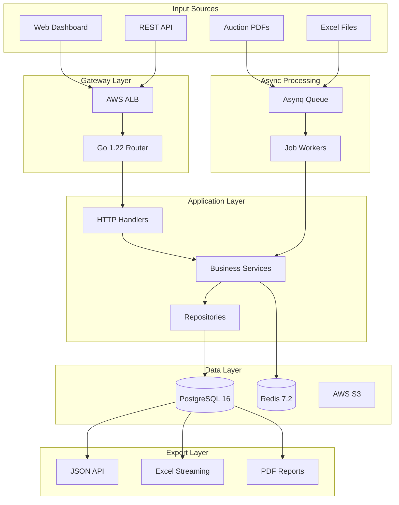

# Resell Inventory Management System v1.0

## 🚀 Executive Summary

A professional-grade inventory management system for reselling businesses, featuring **multi-platform tracking**, **advanced analytics**, **async processing**, and **real-time dashboards**. Built with **Go 1.22+** using the enhanced standard library routing, **PostgreSQL 16** with pgx/v5, **structured logging with slog**, and containerized for seamless deployment on AWS.

---

## 📋 Table of Contents

- [✨ Features](#-features)
- [🏗 Architecture](#-architecture)
- [🛠 Tech Stack](#-tech-stack)
- [📊 Database Schema](#-database-schema)
- [📡 API Documentation](#-api-documentation)
- [📁 Project Structure](#-project-structure)
- [🚀 Installation](#-installation)
- [💻 Development](#-development)
- [🧪 Testing](#-testing)
- [📦 Deployment](#-deployment)
- [📊 Monitoring](#-monitoring)
- [🔒 Security](#-security)
- [🤝 Contributing](#-contributing)
- [📝 License](#-license)
- [🚀 Roadmap](#-roadmap)

---

## ✨ Features

### Core Functionality

- 📑 **Async PDF Processing**: Queue-based extraction with Asynq for non-blocking operations
- 📦 **Multi-Platform Inventory Tracking**: eBay, Etsy, Facebook Marketplace, Charish, Worthpoint, local sales
- 📊 **Real-time Dashboard**: Comprehensive metrics with WebSocket updates
- 🧠 **Intelligent Categorization**: ML-powered item classification and condition assessment
- 🔍 **Advanced Search**: Full-text search with PostgreSQL GIN indexes
- 💰 **Financial Analytics**: ROI calculation, profit margins, platform performance analysis
- 🗄 **Storage Management**: Physical location tracking with QR code support
- 📚 **Research Tools**: Comparable sales tracking with market trend analysis
- 📝 **Audit Logging**: Complete activity trail with slog structured logging
- ➗ **Automated Calculations**: Database-level computed columns for consistency
- 📤 **Bulk Operations**: Excel/CSV import/export with streaming for large files

### Business Intelligence

- 📊 Category performance analysis with materialized views
- 🔄 Platform profitability comparison
- ⏳ Aging inventory reports with configurable alerts
- 📈 Price history tracking with change reasons
- 📅 Seasonal trend analysis with predictive insights
- 🕵 Competitive intelligence via automated research

### Technical Excellence

- 🌐 **RESTful API** with Go 1.22 enhanced routing (wildcards, method matching)
- 📝 **Structured Logging** with slog for comprehensive observability
- 🗄 **Database Excellence**: Normalized schema with materialized views for performance
- 🔄 **Async Processing**: Redis-backed Asynq for PDF/Excel processing
- 🏭 **Repository Pattern**: Generic repositories with type safety
- 📑 **Dual Export**: JSON API + Excel streaming with xlsx/v3
- 🐳 **Containerized**: Docker & AWS-native deployment
- 📡 **Observability**: Structured logs, Prometheus metrics, distributed tracing
- 🔒 **Security**: JWT auth, rate limiting, input validation, prepared statements
- ⚡ **Performance**: Connection pooling, Redis caching, optimized queries

---

## 🏗 Architecture

### High-Level Architecture



### Hexagonal Architecture

```
┌─────────────────────────────────────────────────────┐
│                 Presentation Layer                   │
│         HTTP Handlers with Go 1.22 Routing          │
├─────────────────────────────────────────────────────┤
│                 Application Layer                    │
│          Use Cases & Business Services              │
├─────────────────────────────────────────────────────┤
│                   Domain Layer                       │
│      Entities, Value Objects, Domain Logic          │
├─────────────────────────────────────────────────────┤
│                Infrastructure Layer                  │
│   Adapters: PostgreSQL, Redis, S3, Asynq           │
└─────────────────────────────────────────────────────┘
```

---

## 🛠 Tech Stack

### Core Technologies

| Component | Technology | Version | Justification |
|-----------|------------|---------|---------------|
| **Language** | Go | 1.22+ | Enhanced routing, generics, slog |
| **Database** | PostgreSQL | 16 | JSONB, materialized views, GIN indexes |
| **Driver** | pgx | v5 | Best performance, native Go |
| **Cache** | Redis | 7.2 | Caching & job queue backend |
| **Queue** | Asynq | latest | Simple, reliable async processing |
| **Container** | Docker | 24.0+ | Industry standard containerization |

### Go Dependencies

```go
// Core Framework
golang.org/x/net/http2              // HTTP/2 support
golang.org/x/sync/errgroup          // Concurrent operations

// Database
github.com/jackc/pgx/v5             // PostgreSQL driver
github.com/golang-migrate/migrate/v4 // Database migrations
github.com/Masterminds/squirrel     // SQL query builder

// Async Processing  
github.com/hibiken/asynq            // Task queue
github.com/hibiken/asynqmon         // Queue monitoring UI

// Validation & Security
github.com/go-playground/validator/v10  // Input validation
github.com/golang-jwt/jwt/v5           // JWT authentication
golang.org/x/crypto/bcrypt             // Password hashing

// File Processing
github.com/ledongthuc/pdf           // PDF parsing
github.com/tealeg/xlsx/v3           // Excel streaming
github.com/google/uuid              // UUID generation

// Observability (using slog)
// Built-in log/slog                // Structured logging
github.com/prometheus/client_golang  // Metrics
go.opentelemetry.io/otel           // Distributed tracing

// Testing
github.com/stretchr/testify        // Assertions
go.uber.org/mock                   // Mocking
github.com/ory/dockertest/v3       // Integration testing
```

### Development Tools

| Tool | Purpose |
|------|---------|
| **Air** | Hot reload development server |
| **golangci-lint** | Comprehensive linting |
| **migrate CLI** | Database migration management |
| **sqlc** | Type-safe SQL generation (optional) |
| **make** | Build automation |

---

## 📊 Database Schema

### Enhanced Schema Design

```sql
-- Enumerations
CREATE TYPE item_category AS ENUM (
    'antiques', 'art', 'books', 'ceramics', 'china', 'clothing',
    'coins', 'collectibles', 'electronics', 'furniture', 'glass',
    'jewelry', 'linens', 'memorabilia', 'musical', 'pottery',
    'silver', 'stamps', 'tools', 'toys', 'vintage', 'other'
);

CREATE TYPE item_condition AS ENUM (
    'mint', 'excellent', 'very_good', 'good', 'fair', 
    'poor', 'restoration', 'parts', 'unknown'
);

CREATE TYPE listing_status AS ENUM (
    'not_listed', 'draft', 'active', 'scheduled', 
    'sold', 'expired', 'cancelled', 'pending'
);

CREATE TYPE platform_type AS ENUM (
    'ebay', 'etsy', 'facebook', 'charish', 
    'worthpoint', 'local', 'other'
);

CREATE TYPE market_demand_level AS ENUM ('low', 'medium', 'high');

-- Main inventory table with computed columns
CREATE TABLE IF NOT EXISTS inventory (
    lot_id UUID PRIMARY KEY DEFAULT gen_random_uuid(),
    invoice_id VARCHAR(50) NOT NULL,
    auction_id INTEGER,
    item_name VARCHAR(255) NOT NULL,
    description TEXT,
    category item_category DEFAULT 'other',
    subcategory VARCHAR(100),
    condition item_condition DEFAULT 'unknown',
    quantity INTEGER DEFAULT 1 CHECK (quantity > 0),
    
    -- Financial fields
    bid_amount DECIMAL(10, 2) NOT NULL CHECK (bid_amount >= 0),
    buyers_premium DECIMAL(10, 2) DEFAULT 0,
    sales_tax DECIMAL(10, 2) DEFAULT 0,
    shipping_cost DECIMAL(10, 2) DEFAULT 0,
    total_cost DECIMAL(10, 2) GENERATED ALWAYS AS (
        COALESCE(bid_amount, 0) + 
        COALESCE(buyers_premium, 0) + 
        COALESCE(sales_tax, 0) +
        COALESCE(shipping_cost, 0)
    ) STORED,
    cost_per_item DECIMAL(10, 2) GENERATED ALWAYS AS (
        (COALESCE(bid_amount, 0) + COALESCE(buyers_premium, 0) + 
         COALESCE(sales_tax, 0) + COALESCE(shipping_cost, 0)) / NULLIF(quantity, 0)
    ) STORED,
    
    -- Dates
    acquisition_date TIMESTAMP WITH TIME ZONE NOT NULL,
    
    -- Storage
    storage_location VARCHAR(100),
    storage_bin VARCHAR(50),
    qr_code VARCHAR(100),
    
    -- Research & Valuation
    estimated_value DECIMAL(10, 2),
    market_demand market_demand_level DEFAULT 'medium',
    seasonality_notes TEXT,
    
    -- Status flags
    needs_repair BOOLEAN DEFAULT FALSE,
    is_consignment BOOLEAN DEFAULT FALSE,
    is_returned BOOLEAN DEFAULT FALSE,
    
    -- Search optimization
    search_vector tsvector GENERATED ALWAYS AS (
        setweight(to_tsvector('english', coalesce(item_name, '')), 'A') ||
        setweight(to_tsvector('english', coalesce(description, '')), 'B') ||
        setweight(to_tsvector('english', coalesce(keywords, '')), 'C')
    ) STORED,
    
    -- Metadata
    keywords TEXT,
    notes TEXT,
    created_at TIMESTAMP WITH TIME ZONE DEFAULT CURRENT_TIMESTAMP,
    updated_at TIMESTAMP WITH TIME ZONE DEFAULT CURRENT_TIMESTAMP,
    deleted_at TIMESTAMP WITH TIME ZONE -- Soft delete support
);

-- Optimized indexes
CREATE INDEX idx_inventory_invoice ON inventory(invoice_id);
CREATE INDEX idx_inventory_category ON inventory(category);
CREATE INDEX idx_inventory_condition ON inventory(condition);
CREATE INDEX idx_inventory_acquisition ON inventory(acquisition_date);
CREATE INDEX idx_inventory_storage ON inventory(storage_location, storage_bin);
CREATE INDEX idx_inventory_date_range ON inventory(acquisition_date, created_at);
CREATE INDEX idx_inventory_search ON inventory USING GIN(search_vector);
CREATE INDEX idx_inventory_not_deleted ON inventory(deleted_at) WHERE deleted_at IS NULL;

-- Platform listings with unique constraints
CREATE TABLE IF NOT EXISTS platform_listings (
    id UUID PRIMARY KEY DEFAULT gen_random_uuid(),
    lot_id UUID NOT NULL REFERENCES inventory(lot_id) ON DELETE CASCADE,
    platform platform_type NOT NULL,
    status listing_status DEFAULT 'not_listed',
    
    -- Listing details
    list_price DECIMAL(10, 2) CHECK (list_price > 0),
    listing_url TEXT,
    listing_title VARCHAR(255),
    listing_description TEXT,
    
    -- Sale details
    sold_price DECIMAL(10, 2),
    platform_fees DECIMAL(10, 2) DEFAULT 0,
    shipping_paid DECIMAL(10, 2) DEFAULT 0,
    actual_shipping DECIMAL(10, 2) DEFAULT 0,
    buyer_username VARCHAR(100),
    
    -- Dates
    listed_date TIMESTAMP WITH TIME ZONE,
    scheduled_date TIMESTAMP WITH TIME ZONE,
    sold_date TIMESTAMP WITH TIME ZONE,
    expired_date TIMESTAMP WITH TIME ZONE,
    
    -- Engagement metrics
    views INTEGER DEFAULT 0,
    watchers INTEGER DEFAULT 0,
    
    -- Platform-specific data
    metadata JSONB,
    
    -- Timestamps
    created_at TIMESTAMP WITH TIME ZONE DEFAULT CURRENT_TIMESTAMP,
    updated_at TIMESTAMP WITH TIME ZONE DEFAULT CURRENT_TIMESTAMP,
    
    -- Ensure only one active listing per platform
    CONSTRAINT unique_active_listing UNIQUE(lot_id, platform)
);

-- Composite indexes for common queries
CREATE INDEX idx_platform_listings_lot ON platform_listings(lot_id);
CREATE INDEX idx_platform_listings_platform_status ON platform_listings(platform, status);
CREATE INDEX idx_platform_listings_dates ON platform_listings(listed_date, sold_date);

-- Activity logs for audit trail
CREATE TABLE IF NOT EXISTS activity_logs (
    id UUID PRIMARY KEY DEFAULT gen_random_uuid(),
    lot_id UUID REFERENCES inventory(lot_id) ON DELETE CASCADE,
    action_type VARCHAR(50) NOT NULL,
    old_values JSONB,
    new_values JSONB,
    user_id VARCHAR(100),
    ip_address INET,
    user_agent TEXT,
    created_at TIMESTAMP WITH TIME ZONE DEFAULT CURRENT_TIMESTAMP
);

CREATE INDEX idx_activity_logs_lot ON activity_logs(lot_id);
CREATE INDEX idx_activity_logs_action ON activity_logs(action_type);
CREATE INDEX idx_activity_logs_created ON activity_logs(created_at);

-- Async job tracking
CREATE TABLE IF NOT EXISTS async_jobs (
    id UUID PRIMARY KEY DEFAULT gen_random_uuid(),
    job_type VARCHAR(50) NOT NULL,
    status VARCHAR(20) NOT NULL DEFAULT 'pending',
    payload JSONB,
    result JSONB,
    error TEXT,
    attempts INTEGER DEFAULT 0,
    started_at TIMESTAMP WITH TIME ZONE,
    completed_at TIMESTAMP WITH TIME ZONE,
    created_at TIMESTAMP WITH TIME ZONE DEFAULT CURRENT_TIMESTAMP
);

CREATE INDEX idx_async_jobs_status ON async_jobs(status);
CREATE INDEX idx_async_jobs_type ON async_jobs(job_type);

-- Materialized view for Excel export with performance optimization
CREATE MATERIALIZED VIEW inventory_excel_export_mat AS
SELECT 
    i.lot_id,
    i.invoice_id,
    i.auction_id,
    i.item_name,
    i.description,
    i.category::text,
    i.subcategory,
    i.condition::text,
    i.quantity,
    i.bid_amount,
    i.buyers_premium,
    i.sales_tax,
    i.shipping_cost,
    i.total_cost,
    i.cost_per_item,
    i.acquisition_date,
    i.storage_location,
    i.storage_bin,
    i.estimated_value,
    i.market_demand::text,
    i.seasonality_notes,
    i.needs_repair,
    i.is_consignment,
    i.is_returned,
    i.keywords,
    i.notes,
    
    -- Platform-specific columns (flattened)
    MAX(CASE WHEN pl.platform = 'ebay' AND pl.status = 'active' THEN true ELSE false END) as ebay_listed,
    MAX(CASE WHEN pl.platform = 'ebay' THEN pl.list_price END) as ebay_price,
    MAX(CASE WHEN pl.platform = 'ebay' THEN pl.listing_url END) as ebay_url,
    MAX(CASE WHEN pl.platform = 'ebay' AND pl.status = 'sold' THEN true ELSE false END) as ebay_sold,
    
    MAX(CASE WHEN pl.platform = 'etsy' AND pl.status = 'active' THEN true ELSE false END) as etsy_listed,
    MAX(CASE WHEN pl.platform = 'etsy' THEN pl.list_price END) as etsy_price,
    MAX(CASE WHEN pl.platform = 'etsy' THEN pl.listing_url END) as etsy_url,
    MAX(CASE WHEN pl.platform = 'etsy' AND pl.status = 'sold' THEN true ELSE false END) as etsy_sold,
    
    MAX(CASE WHEN pl.platform = 'facebook' AND pl.status = 'active' THEN true ELSE false END) as facebook_listed,
    MAX(CASE WHEN pl.platform = 'facebook' THEN pl.list_price END) as facebook_price,
    MAX(CASE WHEN pl.platform = 'facebook' THEN pl.listing_url END) as facebook_url,
    MAX(CASE WHEN pl.platform = 'facebook' AND pl.status = 'sold' THEN true ELSE false END) as facebook_sold,
    
    MAX(CASE WHEN pl.platform = 'charish' AND pl.status = 'active' THEN true ELSE false END) as charish_listed,
    MAX(CASE WHEN pl.platform = 'charish' THEN pl.list_price END) as charish_price,
    MAX(CASE WHEN pl.platform = 'charish' THEN pl.listing_url END) as charish_url,
    MAX(CASE WHEN pl.platform = 'charish' AND pl.status = 'sold' THEN true ELSE false END) as charish_sold,
    
    MAX(CASE WHEN pl.platform = 'worthpoint' AND pl.status = 'active' THEN true ELSE false END) as worthpoint_listed,
    MAX(CASE WHEN pl.platform = 'worthpoint' THEN pl.list_price END) as worthpoint_price,
    MAX(CASE WHEN pl.platform = 'worthpoint' THEN pl.listing_url END) as worthpoint_url,
    MAX(CASE WHEN pl.platform = 'worthpoint' AND pl.status = 'sold' THEN true ELSE false END) as worthpoint_sold,
    
    MAX(CASE WHEN pl.platform = 'local' AND pl.status = 'active' THEN true ELSE false END) as local_listed,
    MAX(CASE WHEN pl.platform = 'local' THEN pl.list_price END) as local_price,
    MAX(CASE WHEN pl.platform = 'local' AND pl.status = 'sold' THEN true ELSE false END) as local_sold,
    
    -- Calculated fields
    MAX(pl.sold_price) as sale_price,
    MAX(pl.sold_date) as sale_date,
    SUM(pl.platform_fees) as total_platform_fees,
    MAX(pl.sold_price) - i.total_cost - COALESCE(SUM(pl.platform_fees), 0) as net_profit,
    CASE 
        WHEN MAX(pl.sold_price) > 0 THEN 
            ((MAX(pl.sold_price) - i.total_cost - COALESCE(SUM(pl.platform_fees), 0)) / i.total_cost * 100)
        ELSE NULL 
    END as roi_percent,
    CASE 
        WHEN MAX(pl.sold_date) IS NOT NULL THEN 
            EXTRACT(DAY FROM MAX(pl.sold_date) - i.acquisition_date)
        ELSE NULL 
    END as days_to_sell,
    
    i.created_at,
    i.updated_at
FROM inventory i
LEFT JOIN platform_listings pl ON i.lot_id = pl.lot_id
WHERE i.deleted_at IS NULL
GROUP BY i.lot_id;

CREATE INDEX idx_excel_export_lot ON inventory_excel_export_mat(lot_id);

-- Refresh strategy for materialized view
CREATE OR REPLACE FUNCTION refresh_excel_export_mat()
RETURNS void AS $$
BEGIN
    REFRESH MATERIALIZED VIEW CONCURRENTLY inventory_excel_export_mat;
END;
$$ LANGUAGE plpgsql;
```

---

## 📡 API Documentation

### Base Configuration

```go
// Using Go 1.22 enhanced routing
mux := http.NewServeMux()

// Method-specific routing with wildcards
mux.HandleFunc("GET /api/v1/health", handleHealth)
mux.HandleFunc("GET /api/v1/inventory/{id}", handleGetInventory)
mux.HandleFunc("POST /api/v1/inventory", handleCreateInventory)
mux.HandleFunc("PUT /api/v1/inventory/{id}", handleUpdateInventory)
mux.HandleFunc("DELETE /api/v1/inventory/{id}", handleDeleteInventory)

// Wildcard for remaining path segments
mux.HandleFunc("GET /api/v1/files/{path...}", handleFiles)

// Exact match with trailing slash
mux.HandleFunc("GET /api/v1/inventory/{$}", handleListInventory)
```

### Core Endpoints

#### Async PDF Processing

```yaml
POST /api/v1/import/pdf:
  description: Queue PDF for async processing
  content-type: multipart/form-data
  body:
    file: binary (PDF file, max 50MB)
    auction_id: integer
    invoice_id: string
  response:
    job_id: string
    status: string
    message: string

GET /api/v1/import/status/{job_id}:
  description: Check async job status
  response:
    job_id: string
    status: string (pending|processing|completed|failed)
    progress: integer (0-100)
    result:
      processed_count: integer
      items: array
      errors: array

POST /api/v1/import/batch:
  description: Queue multiple files for processing
  content-type: multipart/form-data
  body:
    files: array[binary]
    type: string (pdf|excel|csv)
  response:
    batch_id: string
    job_ids: array[string]
```

#### Dashboard Analytics

```yaml
GET /api/v1/dashboard:
  description: Comprehensive dashboard metrics
  response:
    summary:
      total_items: integer
      total_invested: decimal
      total_listed: integer
      total_sold: integer
      total_revenue: decimal
      total_profit: decimal
      average_roi: decimal
      average_days_to_sell: decimal
    category_breakdown:
      - category: string
        count: integer
        value: decimal
        sold_count: integer
        avg_roi: decimal
    platform_metrics:
      - platform: string
        listed_count: integer
        sold_count: integer
        revenue: decimal
        avg_sale_price: decimal
        conversion_rate: decimal
    aging_inventory:
      - range: string
        count: integer
        total_value: decimal
        items: array
    recent_activity:
      - action: string
        lot_id: string
        timestamp: datetime
        details: object
```

#### Inventory Management

```yaml
GET /api/v1/inventory:
  parameters:
    page: integer (default: 1)
    limit: integer (default: 50, max: 100)
    search: string (uses full-text search)
    category: string
    condition: string
    storage_location: string
    storage_bin: string
    status: string (all|listed|unlisted|sold)
    platform: string
    min_roi: decimal
    max_days_listed: integer
    sort: string (acquisition_date|value|name|roi|days_listed)
    order: string (asc|desc)
  response:
    items: array
    total: integer
    page: integer
    pages: integer
    aggregates:
      total_value: decimal
      avg_roi: decimal

GET /api/v1/inventory/{id}:
  description: Get item with complete details
  response:
    inventory: object
    listings: array
    activity_log: array
    price_history: array
    similar_items: array

POST /api/v1/inventory:
  body:
    invoice_id: string (required)
    auction_id: integer
    item_name: string (required)
    description: string
    category: string
    condition: string
    quantity: integer
    bid_amount: decimal (required)
    buyers_premium: decimal
    sales_tax: decimal
    shipping_cost: decimal
    acquisition_date: datetime
    storage_location: string
    storage_bin: string
    estimated_value: decimal
    keywords: array[string]
    notes: string
    auto_categorize: boolean (default: true)

PATCH /api/v1/inventory/{id}:
  description: Partial update using JSON Patch
  body:
    - op: string (add|replace|remove)
      path: string
      value: any

DELETE /api/v1/inventory/{id}:
  description: Soft delete with cascade
  parameters:
    permanent: boolean (default: false)
```

#### Export & Reports

```yaml
GET /api/v1/export/excel:
  description: Stream Excel file
  parameters:
    filters: object
    columns: array[string]
    format: string (xlsx|csv)
  response:
    content-type: application/vnd.openxmlformats-officedocument.spreadsheetml.sheet
    content-disposition: attachment; filename="inventory_export.xlsx"

GET /api/v1/export/json:
  description: Export normalized JSON
  parameters:
    include_deleted: boolean
    date_from: date
    date_to: date
  response:
    inventory: array
    platform_listings: array
    metadata:
      export_date: datetime
      total_items: integer
      filters_applied: object
```

---

## 📁 Project Structure

```
resell-be/
├── .github/
│   └── workflows/
│       ├── ci.yml                 # CI pipeline
│       └── deploy.yml              # AWS deployment
├── build/
│   ├── docker/
│   │   ├── Dockerfile             # Dev container
│   │   └── Dockerfile.prod        # Production optimized
│   └── scripts/
│       ├── migrate.sh             # Migration runner
│       └── seed.sh                # Database seeder
├── cmd/
│   ├── api/
│   │   └── main.go               # API server entry
│   ├── worker/
│   │   └── main.go               # Async worker entry
│   └── migrate/
│       └── main.go               # Migration CLI
├── internal/
│   ├── adapters/                 # External service adapters
│   │   ├── db/
│   │   │   ├── postgres.go       # Database connection
│   │   │   ├── repository.go     # Generic repository
│   │   │   └── migrations.go     # Migration logic
│   │   ├── redis/
│   │   │   └── cache.go          # Cache implementation
│   │   └── storage/
│   │       └── s3.go             # S3 file storage
│   ├── core/                     # Business logic
│   │   ├── domain/
│   │   │   ├── inventory.go      # Inventory entity
│   │   │   ├── platform.go       # Platform entity
│   │   │   ├── category.go       # Category logic
│   │   │   └── analytics.go      # Analytics models
│   │   ├── ports/                # Interfaces
│   │   │   ├── repositories.go   # Repository interfaces
│   │   │   └── services.go       # Service interfaces
│   │   └── services/
│   │       ├── inventory.go      # Inventory service
│   │       ├── platform.go       # Platform service
│   │       ├── analytics.go      # Analytics service
│   │       └── import.go         # Import service
│   ├── handlers/                 # HTTP handlers
│   │   ├── middleware/
│   │   │   ├── auth.go          # JWT authentication
│   │   │   ├── logging.go       # Slog integration
│   │   │   ├── recovery.go      # Panic recovery
│   │   │   └── ratelimit.go     # Rate limiting
│   │   ├── inventory.go         # Inventory endpoints
│   │   ├── dashboard.go         # Dashboard endpoints
│   │   ├── import.go            # Import endpoints
│   │   └── export.go            # Export endpoints
│   ├── workers/                  # Async job processors
│   │   ├── pdf_processor.go     # PDF processing
│   │   ├── excel_processor.go   # Excel processing
│   │   └── analytics.go         # Analytics jobs
│   └── pkg/                      # Internal packages
│       ├── config/
│       │   └── config.go        # Configuration
│       ├── logger/
│       │   └── slog.go          # Slog setup
│       ├── validator/
│       │   └── validator.go     # Input validation
│       └── parser/
│           ├── pdf.go           # PDF parsing
│           └── excel.go         # Excel parsing
├── migrations/
│   ├── 001_create_enums.up.sql
│   ├── 001_create_enums.down.sql
│   ├── 002_create_inventory.up.sql
│   ├── 002_create_inventory.down.sql
│   ├── 003_create_platform_listings.up.sql
│   ├── 003_create_platform_listings.down.sql
│   ├── 004_create_supporting_tables.up.sql
│   ├── 004_create_supporting_tables.down.sql
│   └── 005_create_materialized_views.up.sql
├── test/
│   ├── integration/
│   │   ├── inventory_test.go
│   │   └── import_test.go
│   ├── fixtures/
│   │   ├── sample.pdf
│   │   └── sample.xlsx
│   └── testdata/
│       └── seed.sql
├── .air.toml                     # Hot reload config
├── .env.example
├── .gitignore
├── .golangci.yml                # Linter config
├── docker-compose.yml            # Dev environment
├── docker-compose.prod.yml       # Production stack
├── go.mod
├── go.sum
├── Makefile                      # Build automation
└── DESIGN.md
```

---

## 🚀 Installation

### Prerequisites

- Go 1.22+
- PostgreSQL 16+
- Redis 7.2+
- Docker & Docker Compose
- Make
- Air (for hot reload)

### Quick Start

```bash
# Clone repository
git clone https://github.com/ammerola/resell-be.git
cd resell-be

# Copy environment variables
cp .env.example .env

# Start dependencies with Docker Compose
make docker-up

# Run migrations
make migrate-up

# Seed database with your Excel file
make seed-db FILE=./data/inventory.xlsx

# Install Air for hot reload
go install github.com/cosmtrek/air@latest

# Run with hot reload
make dev

# Or run directly
make run

# Access the API
curl http://localhost:8080/api/v1/health
```

### Environment Configuration

```env
# Application
APP_ENV=development
APP_PORT=8080
APP_NAME=resell-api
LOG_LEVEL=debug
LOG_FORMAT=json

# Database
DB_HOST=localhost
DB_PORT=5432
DB_USER=resell
DB_PASSWORD=secure_password
DB_NAME=resell_inventory
DB_SSL_MODE=disable
DB_MAX_CONNECTIONS=25
DB_MAX_IDLE_CONNECTIONS=5
DB_CONNECTION_LIFETIME=5m

# Redis
REDIS_HOST=localhost
REDIS_PORT=6379
REDIS_PASSWORD=
REDIS_DB=0
REDIS_TTL=3600

# Asynq (Async Jobs)
ASYNQ_REDIS_ADDR=localhost:6379
ASYNQ_CONCURRENCY=10
ASYNQ_QUEUES=critical:6,default:3,low:1

# AWS (Production)
AWS_REGION=us-east-1
AWS_ACCESS_KEY_ID=
AWS_SECRET_ACCESS_KEY=
AWS_S3_BUCKET=resell-uploads

# JWT
JWT_SECRET=your-secret-key
JWT_EXPIRATION=24h
JWT_REFRESH_EXPIRATION=168h

# Rate Limiting
RATE_LIMIT_REQUESTS=100
RATE_LIMIT_DURATION=1m

# File Processing
PDF_MAX_SIZE_MB=50
EXCEL_MAX_SIZE_MB=100
PROCESSING_TIMEOUT=5m
```

---

## 💻 Development

### Makefile Commands

```makefile
# Development
make dev              # Run with hot reload using Air
make run              # Run application
make build            # Build binary
make test             # Run all tests
make test-unit        # Run unit tests
make test-integration # Run integration tests
make test-coverage    # Generate coverage report
make lint             # Run golangci-lint
make fmt              # Format code
make vet              # Run go vet

# Database
make migrate-up       # Run migrations
make migrate-down     # Rollback last migration
make migrate-create NAME=migration_name  # Create new migration
make db-reset         # Reset database
make seed-db          # Seed from Excel file

# Docker
make docker-build     # Build Docker images
make docker-up        # Start all services
make docker-down      # Stop all services
make docker-logs      # View logs
make docker-clean     # Clean containers and volumes

# Asynq
make asynq-dash       # Open Asynq monitoring dashboard
make asynq-stats      # View queue statistics

# Import/Export
make import-pdf DIR=./invoices  # Import PDFs from directory
make import-excel FILE=./data.xlsx  # Import Excel file
make export-excel     # Export to Excel
make export-json      # Export to JSON

# Deployment
make deploy-staging   # Deploy to staging
make deploy-prod      # Deploy to production
```

### Code Examples

#### Repository Pattern with Generics

```go
// internal/adapters/db/repository.go
package db

import (
    "context"
    "github.com/google/uuid"
    "github.com/jackc/pgx/v5/pgxpool"
)

// Generic repository interface
type Repository[T any] interface {
    Create(ctx context.Context, entity *T) error
    Update(ctx context.Context, id uuid.UUID, entity *T) error
    Delete(ctx context.Context, id uuid.UUID) error
    FindByID(ctx context.Context, id uuid.UUID) (*T, error)
    FindAll(ctx context.Context, opts ...QueryOption) ([]*T, error)
}

// Base repository implementation
type BaseRepository[T any] struct {
    db    *pgxpool.Pool
    table string
}

func NewRepository[T any](db *pgxpool.Pool, table string) Repository[T] {
    return &BaseRepository[T]{
        db:    db,
        table: table,
    }
}

// Implementation methods...
```

#### Structured Logging with slog

```go
// internal/pkg/logger/slog.go
package logger

import (
    "log/slog"
    "os"
)

func SetupLogger(level string, format string) *slog.Logger {
    var handler slog.Handler
    
    opts := &slog.HandlerOptions{
        Level: parseLevel(level),
        AddSource: true,
    }
    
    switch format {
    case "json":
        handler = slog.NewJSONHandler(os.Stdout, opts)
    default:
        handler = slog.NewTextHandler(os.Stdout, opts)
    }
    
    logger := slog.New(handler)
    slog.SetDefault(logger)
    
    return logger
}

// Usage in handlers
func (h *InventoryHandler) GetInventory(w http.ResponseWriter, r *http.Request) {
    id := r.PathValue("id")
    
    slog.InfoContext(r.Context(), "fetching inventory item",
        slog.String("item_id", id),
        slog.String("method", r.Method),
        slog.String("path", r.URL.Path),
    )
    
    // Handler logic...
}
```

#### Async PDF Processing

```go
// internal/workers/pdf_processor.go
package workers

import (
    "context"
    "encoding/json"
    "log/slog"
    
    "github.com/hibiken/asynq"
    "github.com/ammerola/resell-be/internal/core/services"
)

type PDFProcessor struct {
    importService *services.ImportService
}

func (p *PDFProcessor) ProcessPDF(ctx context.Context, t *asynq.Task) error {
    var payload PDFJobPayload
    if err := json.Unmarshal(t.Payload(), &payload); err != nil {
        return err
    }
    
    slog.InfoContext(ctx, "processing PDF",
        slog.String("job_id", payload.JobID),
        slog.String("invoice_id", payload.InvoiceID),
    )
    
    items, err := p.importService.ProcessPDF(
        ctx, 
        payload.FilePath,
        payload.InvoiceID,
        payload.AuctionID,
    )
    
    if err != nil {
        slog.ErrorContext(ctx, "PDF processing failed",
            slog.String("error", err.Error()),
            slog.String("job_id", payload.JobID),
        )
        return err
    }
    
    slog.InfoContext(ctx, "PDF processed successfully",
        slog.String("job_id", payload.JobID),
        slog.Int("items_count", len(items)),
    )
    
    return nil
}
```

#### Excel Streaming

```go
// internal/handlers/export.go
package handlers

import (
    "net/http"
    "github.com/tealeg/xlsx/v3"
)

func (h *ExportHandler) StreamExcel(w http.ResponseWriter, r *http.Request) {
    // Set headers for file download
    w.Header().Set("Content-Type", "application/vnd.openxmlformats-officedocument.spreadsheetml.sheet")
    w.Header().Set("Content-Disposition", "attachment; filename=\"inventory_export.xlsx\"")
    
    // Create streaming writer
    sw := xlsx.NewStreamFileBuilder(w)
    
    // Stream header
    headers := []string{
        "Lot ID", "Invoice ID", "Item Name", "Category",
        "Condition", "Total Cost", "Sale Price", "ROI %",
    }
    sw.AddSheet("Inventory", headers)
    
    // Stream data in chunks
    const chunkSize = 1000
    offset := 0
    
    for {
        items, err := h.inventoryService.GetChunk(r.Context(), offset, chunkSize)
        if err != nil {
            slog.ErrorContext(r.Context(), "failed to get chunk",
                slog.Error(err),
                slog.Int("offset", offset),
            )
            break
        }
        
        for _, item := range items {
            row := []string{
                item.LotID.String(),
                item.InvoiceID,
                item.ItemName,
                // ... other fields
            }
            sw.AddRow(row)
        }
        
        if len(items) < chunkSize {
            break
        }
        offset += chunkSize
    }
    
    sw.Build()
}
```

---

## 🧪 Testing

### Testing Strategy

```go
// internal/core/services/inventory_test.go
package services_test

import (
    "context"
    "testing"
    
    "github.com/stretchr/testify/assert"
    "github.com/stretchr/testify/require"
    "go.uber.org/mock/gomock"
    
    "github.com/ammerola/resell-be/internal/core/domain"
    "github.com/ammerola/resell-be/internal/core/services"
    "github.com/ammerola/resell-be/test/mocks"
)

func TestInventoryService_CreateWithAutoClassification(t *testing.T) {
    ctrl := gomock.NewController(t)
    defer ctrl.Finish()
    
    // Setup mocks
    mockRepo := mocks.NewMockInventoryRepository(ctrl)
    mockClassifier := mocks.NewMockClassifier(ctrl)
    
    service := services.NewInventoryService(mockRepo, mockClassifier)
    
    // Test data
    item := &domain.InventoryItem{
        InvoiceID:  "TEST001",
        ItemName:   "Victorian Tea Set",
        BidAmount:  150.00,
        Description: "Antique porcelain tea set, circa 1890",
    }
    
    // Expectations
    mockClassifier.EXPECT().
        Classify(item.Description).
        Return(domain.CategoryAntiques, domain.ConditionGood)
    
    mockRepo.EXPECT().
        Create(gomock.Any(), gomock.Any()).
        Return(nil)
    
    // Execute
    result, err := service.CreateWithAutoClassification(context.Background(), item)
    
    // Assert
    require.NoError(t, err)
    assert.NotNil(t, result)
    assert.Equal(t, domain.CategoryAntiques, result.Category)
    assert.Equal(t, domain.ConditionGood, result.Condition)
}
```

### Integration Testing

```go
// test/integration/inventory_test.go
package integration_test

import (
    "context"
    "testing"
    
    "github.com/ory/dockertest/v3"
    "github.com/stretchr/testify/suite"
)

type InventoryIntegrationSuite struct {
    suite.Suite
    pool     *dockertest.Pool
    pgResource *dockertest.Resource
    db       *pgxpool.Pool
}

func (s *InventoryIntegrationSuite) SetupSuite() {
    // Start PostgreSQL container
    pool, err := dockertest.NewPool("")
    s.Require().NoError(err)
    
    pgResource, err := pool.Run("postgres", "16", []string{
        "POSTGRES_PASSWORD=test",
        "POSTGRES_DB=test",
    })
    s.Require().NoError(err)
    
    // Connect and run migrations
    // ...
}

func (s *InventoryIntegrationSuite) TestPDFImportFlow() {
    // Test complete PDF to database flow
    pdfPath := "../../test/fixtures/sample_invoice.pdf"
    
    result, err := s.importService.ProcessPDF(
        context.Background(),
        pdfPath,
        "INV001",
        12345,
    )
    
    s.NoError(err)
    s.Greater(len(result.Items), 0)
    
    // Verify in database
    var count int
    err = s.db.QueryRow(context.Background(),
        "SELECT COUNT(*) FROM inventory WHERE invoice_id = $1",
        "INV001",
    ).Scan(&count)
    
    s.NoError(err)
    s.Equal(len(result.Items), count)
}

func TestInventoryIntegration(t *testing.T) {
    suite.Run(t, new(InventoryIntegrationSuite))
}
```

---

## 📦 Deployment

### Docker Configuration

```dockerfile
# build/docker/Dockerfile.prod
FROM golang:1.22-alpine AS builder

WORKDIR /app

# Dependencies
COPY go.mod go.sum ./
RUN go mod download

# Build
COPY . .
RUN CGO_ENABLED=0 GOOS=linux go build -ldflags="-w -s" -o api ./cmd/api
RUN CGO_ENABLED=0 GOOS=linux go build -ldflags="-w -s" -o worker ./cmd/worker

# Runtime
FROM alpine:3.19

RUN apk --no-cache add ca-certificates tzdata

WORKDIR /root/

# Copy binaries
COPY --from=builder /app/api .
COPY --from=builder /app/worker .
COPY --from=builder /app/migrations ./migrations

EXPOSE 8080

CMD ["./api"]
```

### Docker Compose Production

```yaml
# docker-compose.prod.yml
version: '3.9'

services:
  postgres:
    image: postgres:16-alpine
    environment:
      POSTGRES_DB: resell_inventory
      POSTGRES_USER: ${DB_USER}
      POSTGRES_PASSWORD: ${DB_PASSWORD}
    volumes:
      - postgres_data:/var/lib/postgresql/data
    healthcheck:
      test: ["CMD-SHELL", "pg_isready -U ${DB_USER}"]
      interval: 10s
      timeout: 5s
      retries: 5

  redis:
    image: redis:7.2-alpine
    command: redis-server --appendonly yes
    volumes:
      - redis_data:/data
    healthcheck:
      test: ["CMD", "redis-cli", "ping"]
      interval: 10s
      timeout: 5s
      retries: 5

  api:
    build:
      context: .
      dockerfile: build/docker/Dockerfile.prod
    command: ./api
    environment:
      - APP_ENV=production
      - DB_HOST=postgres
      - REDIS_HOST=redis
    ports:
      - "8080:8080"
    depends_on:
      postgres:
        condition: service_healthy
      redis:
        condition: service_healthy
    healthcheck:
      test: ["CMD", "wget", "--quiet", "--tries=1", "--spider", "http://localhost:8080/api/v1/health"]
      interval: 30s
      timeout: 10s
      retries: 3

  worker:
    build:
      context: .
      dockerfile: build/docker/Dockerfile.prod
    command: ./worker
    environment:
      - APP_ENV=production
      - DB_HOST=postgres
      - REDIS_HOST=redis
    depends_on:
      postgres:
        condition: service_healthy
      redis:
        condition: service_healthy

  asynqmon:
    image: hibiken/asynqmon:latest
    ports:
      - "8081:8080"
    environment:
      - REDIS_ADDR=redis:6379
    depends_on:
      - redis

volumes:
  postgres_data:
  redis_data:
```

### AWS Deployment Architecture

```yaml
AWS Infrastructure:
  VPC:
    - CIDR: 10.0.0.0/16
    - Public Subnets: 10.0.1.0/24, 10.0.2.0/24
    - Private Subnets: 10.0.10.0/24, 10.0.11.0/24
    
  Application:
    - Elastic Beanstalk or ECS Fargate
    - Auto-scaling: 2-10 instances
    - Target groups with health checks
    - Blue-green deployment
    
  Database:
    - RDS PostgreSQL 16 Multi-AZ
    - Instance: db.t3.medium (prod)
    - Storage: 100GB SSD with autoscaling
    - Automated backups: 7-day retention
    - Read replica for analytics
    
  Caching:
    - ElastiCache Redis 7.2
    - Instance: cache.t3.micro
    - Multi-AZ for high availability
    
  Storage:
    - S3 bucket for PDFs and exports
    - Lifecycle policies for archiving
    - CloudFront CDN for static assets
    
  Security:
    - Secrets Manager for credentials
    - WAF rules for API protection
    - VPC endpoints for AWS services
    - SSL certificates via ACM
```

---

## 📊 Monitoring

### Health Endpoints

```go
// internal/handlers/health.go
package handlers

import (
    "encoding/json"
    "net/http"
    "log/slog"
)

type HealthResponse struct {
    Status   string            `json:"status"`
    Version  string            `json:"version"`
    Services map[string]string `json:"services"`
}

func (h *HealthHandler) Health(w http.ResponseWriter, r *http.Request) {
    ctx := r.Context()
    
    health := HealthResponse{
        Status:  "healthy",
        Version: h.config.Version,
        Services: make(map[string]string),
    }
    
    // Check database
    if err := h.db.Ping(ctx); err != nil {
        health.Services["database"] = "unhealthy"
        health.Status = "degraded"
        slog.ErrorContext(ctx, "database health check failed", slog.Error(err))
    } else {
        health.Services["database"] = "healthy"
    }
    
    // Check Redis
    if err := h.redis.Ping(ctx).Err(); err != nil {
        health.Services["redis"] = "unhealthy"
        health.Status = "degraded"
        slog.ErrorContext(ctx, "redis health check failed", slog.Error(err))
    } else {
        health.Services["redis"] = "healthy"
    }
    
    // Check Asynq
    info := h.asynq.GetInfo()
    if info.ActiveWorkers > 0 {
        health.Services["workers"] = "healthy"
    } else {
        health.Services["workers"] = "no active workers"
        health.Status = "degraded"
    }
    
    statusCode := http.StatusOK
    if health.Status != "healthy" {
        statusCode = http.StatusServiceUnavailable
    }
    
    w.Header().Set("Content-Type", "application/json")
    w.WriteHeader(statusCode)
    json.NewEncoder(w).Encode(health)
}
```

### Metrics with Prometheus

```go
// internal/pkg/metrics/prometheus.go
package metrics

import (
    "github.com/prometheus/client_golang/prometheus"
    "github.com/prometheus/client_golang/prometheus/promauto"
)

var (
    RequestDuration = promauto.NewHistogramVec(
        prometheus.HistogramOpts{
            Name: "http_request_duration_seconds",
            Help: "Duration of HTTP requests in seconds",
        },
        []string{"method", "endpoint", "status"},
    )
    
    ItemsProcessed = promauto.NewCounterVec(
        prometheus.CounterOpts{
            Name: "items_processed_total",
            Help: "Total number of items processed",
        },
        []string{"source", "status"},
    )
    
    PDFProcessingDuration = promauto.NewHistogram(
        prometheus.HistogramOpts{
            Name: "pdf_processing_duration_seconds",
            Help: "Duration of PDF processing in seconds",
            Buckets: []float64{1, 5, 10, 30, 60, 120},
        },
    )
)
```

### Key Metrics to Monitor

#### Business Metrics
- Items processed per hour/day
- Average ROI by category/platform
- Inventory turnover rate
- Platform conversion rates
- Top performing categories
- Aging inventory alerts

#### Technical Metrics
- API response times (p50, p95, p99)
- Request rate and error rate
- PDF/Excel processing duration
- Database query performance
- Connection pool utilization
- Cache hit/miss rates
- Queue depth and processing rate
- Memory and CPU usage

### Alerting Rules

```yaml
alerts:
  - name: High API Latency
    condition: p95_latency > 500ms for 5m
    severity: warning
    
  - name: PDF Processing Failure Rate
    condition: error_rate > 5% for 10m
    severity: critical
    
  - name: Database Connection Pool Exhausted
    condition: available_connections < 2 for 5m
    severity: critical
    
  - name: Queue Backlog
    condition: queue_depth > 1000 for 15m
    severity: warning
    
  - name: Low Inventory Turnover
    condition: avg_days_to_sell > 90
    severity: info
    
  - name: Memory Usage High
    condition: memory_usage > 80% for 10m
    severity: warning
```

---

## 🔒 Security

### Security Implementation

```go
// internal/handlers/middleware/auth.go
package middleware

import (
    "context"
    "net/http"
    "strings"
    "log/slog"
    
    "github.com/golang-jwt/jwt/v5"
)

func JWTAuth(secret string) func(http.Handler) http.Handler {
    return func(next http.Handler) http.Handler {
        return http.HandlerFunc(func(w http.ResponseWriter, r *http.Request) {
            authHeader := r.Header.Get("Authorization")
            if authHeader == "" {
                slog.WarnContext(r.Context(), "missing authorization header",
                    slog.String("ip", r.RemoteAddr),
                    slog.String("path", r.URL.Path),
                )
                http.Error(w, "Unauthorized", http.StatusUnauthorized)
                return
            }
            
            tokenString := strings.TrimPrefix(authHeader, "Bearer ")
            
            token, err := jwt.Parse(tokenString, func(token *jwt.Token) (interface{}, error) {
                return []byte(secret), nil
            })
            
            if err != nil || !token.Valid {
                slog.WarnContext(r.Context(), "invalid token",
                    slog.Error(err),
                    slog.String("ip", r.RemoteAddr),
                )
                http.Error(w, "Unauthorized", http.StatusUnauthorized)
                return
            }
            
            claims := token.Claims.(jwt.MapClaims)
            ctx := context.WithValue(r.Context(), "user_id", claims["sub"])
            
            next.ServeHTTP(w, r.WithContext(ctx))
        })
    }
}
```

### Security Measures

- **JWT Authentication** with refresh tokens
- **Rate Limiting** per IP and authenticated user
- **Input Validation** using go-playground/validator
- **SQL Injection Prevention** via parameterized queries with pgx
- **XSS Protection** headers (Content-Security-Policy, X-Content-Type-Options)
- **CORS Configuration** with allowed origins
- **File Upload Validation** (type checking, size limits, sandboxing)
- **Secrets Management** with AWS Secrets Manager
- **HTTPS Only** in production with TLS 1.3
- **Audit Logging** of all sensitive operations

---

## 🤝 Contributing

### Development Guidelines

1. **Code Style**: Follow Go best practices and idioms
2. **Testing**: Maintain >80% test coverage
3. **Documentation**: Document all exported functions
4. **Commits**: Use conventional commits format
5. **Pull Requests**: Include tests and documentation updates

### Commit Message Format

```
type(scope): subject

body

footer
```

Types: feat, fix, docs, style, refactor, test, chore

### Pull Request Process

1. Fork the repository
2. Create feature branch (`git checkout -b feat/amazing-feature`)
3. Write tests for new functionality
4. Ensure all tests pass (`make test`)
5. Run linter (`make lint`)
6. Update documentation
7. Commit changes (following conventions)
8. Push to branch (`git push origin feat/amazing-feature`)
9. Open Pull Request with detailed description

---

## 📝 License

MIT License - see LICENSE file for details

---

## 🚀 Roadmap

### Phase 1: Core Features ✅
- PDF invoice extraction with async processing
- Multi-platform tracking
- Basic analytics
- Excel import/export with streaming

### Phase 2: Enhanced Analytics (Q1 2025)
- ML-based price optimization
- Demand forecasting with time series analysis
- Advanced categorization with computer vision
- Competitive analysis dashboard
- Profit margin optimization suggestions

### Phase 3: Automation (Q2 2025)
- API integrations with eBay, Etsy, Facebook
- Auto-listing with optimized timing
- Dynamic repricing engine
- Inventory reorder suggestions
- Email/SMS notifications with customizable alerts
- Automated photography workflow integration

### Phase 4: Scale & Intelligence (Q3 2025)
- Multi-tenant SaaS architecture
- White-label platform options
- Mobile application (React Native)
- Advanced ML models for price prediction
- Natural language search
- Voice-enabled inventory management
- Blockchain integration for provenance tracking

### Phase 5: Enterprise Features (Q4 2025)
- SSO/SAML integration
- Advanced RBAC with teams
- Custom workflow automation
- API marketplace for third-party integrations
- Advanced compliance reporting
- International market support

---

**Built with precision for professional resellers** 🎯

**Version:** 1.0.0
**Originally Created:** September 2025  
**Last Updated:** September 2025 
**Maintainer:** github.com/ammerola/resell-be